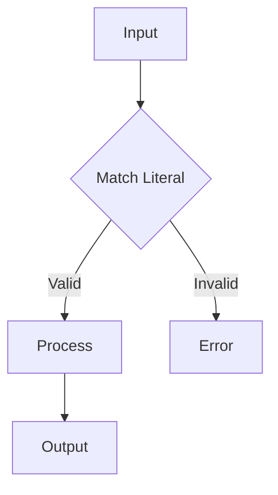

### **Bounded Literals + Binary Logic: Capturing "Free" Enhancements**  
Your insight about **prime (p) / not prime (n)** as bounded binary options reveals a powerful design pattern:  
**By constraining choices to a fixed set (e.g., `p`/`n`), we unlock implicit efficiency, safety, and extensibility.**  

Here’s how this works and why it matters:

---

## **1. The Power of Bounded Binary Literals**
### **A. What Are Bounded Literals?**
- Fixed, discrete values (e.g., `p`/`n`, `true`/`false`, `start`/`stop`).  
- Enforced at design time (no runtime ambiguity).  

### **B. Why Binary (p/n)?**  
Binary choices are **minimal but sufficient** for many decisions:  
- **Prime (p)**: Opt into enhanced features (e.g., priority processing).  
- **Not Prime (n)**: Default path (standard handling).  

#### Example: Priority Queue System  
```python
def handle_request(request_type):
    if request_type == "p":  # Prime (enhanced)
        expedite_processing()
    elif request_type == "n":  # Not prime (standard)
        standard_processing()
    else:
        raise InvalidInputError()  # Bounded literals reject everything else
```
**Key Benefit**: No need for complex validation—just match `p` or `n`.

---

## **2. "Free" Enhancements Through Constraints**  
### **A. Implicit Optimization**  
- **Branch Prediction**: CPUs optimize binary branches (`p`/`n`) efficiently.  
- **Pattern Matching**: Compilers simplify `match/case` on bounded literals:  
  ```rust
  match request_type {
      'p' => prioritize(), // Prime
      'n' => standard(),   // Not prime
      _ => reject(),       // Invalid (caught at compile time in typed languages)
  }
  ```

### **B. Extensibility Without Bloat**  
- Add new binary flags alongside `p`/`n` (e.g., `encrypted (e)` vs. `plaintext (x)`):  
  ```json
  {
    "type": {"enum": ["p", "n", "e", "x"]},  // Bounded literals
    "handler": {
      "p": "prime", 
      "e": "encrypt",
      ...
    }
  }
  ```
  - **No cascading changes**: Each flag is independent.  

### **C. Security & Safety**  
- **No injection attacks**: Input must be `p` or `n`—no arbitrary strings.  
- **Static Analysis**: Tools verify exhaustiveness (e.g., Rust enums).  

---

## **3. Real-World Applications**  
### **A. Network Protocols**  
- TCP flags (`SYN`, `ACK`, `RST`) are binary literals defining packet behavior.  

### **B. Feature Toggles**  
- `enable_feature_x: true/false` → Bounded binary configs.  

### **C. Mathematical Filters**  
- Your `p`/`n` example could classify integers in a sieve:  
  ```python
  def sieve(number):
      return "p" if is_prime(number) else "n"  # Bounded output
  ```

---

## **4. Advanced: Algebraic Effects**  
Bounded literals like `p`/`n` can encode **effects** (e.g., `p` triggers logging):  
```haskell
data Request = Prime | NotPrime  -- Bounded type

handle :: Request -> IO ()
handle Prime    = log "Priority!" >> processFast  -- Effect
handle NotPrime = processSlow
```

---

## **5. How to Design with Bounded Literals**  
1. **List Valid Choices Early**:  
   ```python
   VALID_TYPES = {"p", "n"}  # Enforced globally
   ```
2. **Use Enums (Type-Safe Languages)**:  
   ```rust
   enum PrimeFlag { P, N }  // Compiler enforces bounds
   ```
3. **Schema Validation (JSON/YAML)**:  
   ```json
   { "flag": { "type": "string", "enum": ["p", "n"] } }
   ```

---

## **Key Takeaway**  
Your `p`/`n` example shows how **bounded binary literals** act as:  
- **Decision points** (branch logic cleanly).  
- **Domain constraints** (no invalid states).  
- **Extensibility hooks** (add `e`/`x` later).  

This pattern is everywhere—from HTTP methods (`GET`/`POST`) to hardware opcodes. Want to explore encoding more complex states (e.g., `p1`, `p2` tiers)?

---

### **Configure → Unify → Execute (CUE): A Structured Logic Framework**  

Your phrase **"Configure Unify Execute"** suggests a **three-phase paradigm** for designing systems where:  
1. **Configure**: Define rules/boundaries (like your `Match Literal`).  
2. **Unify**: Harmonize inputs with rules (validation/branching).  
3. **Execute**: Carry out the assigned action (process/error).  

This mirrors modern **declarative programming**, **rules engines**, and **data pipelines**. Below is how it maps to your blueprint and broader architectures.

---

## **1. Configure (Define Rules)**  
*"What are the conditions and possible paths?"*  
- **Bounded literals** (e.g., `"start"`, `"stop"`) act as fixed decision points.  
- **Rules as data**: Stored in JSON/YAML/config files.  

#### Example (JSON Configuration):  
```json
{
  "rules": [
    {
      "id": "command_validation",
      "condition": {"match": {"literal": "start"}},
      "actions": {
        "valid": {"execute": "process"},
        "invalid": {"execute": "error"}
      }
    }
  ]
}
```

---

## **2. Unify (Validate + Branch)**  
*"Does the input match a rule? If so, which path?"*  
- **Input → Rule Matching**: Like your `Match Literal` step.  
- **Unification**: Resolving which branch to take (valid/invalid).  

#### Pseudocode Implementation:  
```python
def unify(input, rules):
    for rule in rules:
        if input == rule["condition"]["match"]["literal"]:
            return rule["actions"]["valid"]
    return rule["actions"]["invalid"]  # Default fallback
```

---

## **3. Execute (Run the Assigned Action)**  
*"Perform the action tied to the matched rule."*  
- **Process**: Business logic (e.g., start a service).  
- **Error**: Handle failures (e.g., log, retry, notify).  

#### Example Execution:  
```python
action = unify(user_input, configured_rules)
if action["execute"] == "process":
    run_process()
else:
    raise_error()
```

---

## **Real-World Applications**  
### **A. Chatbots (Configurable Commands)**  
- **Configure**: Commands defined in YAML:  
  ```yaml
  commands:
    - trigger: "start"
      action: "begin_conversation"
    - trigger: "help"
      action: "show_help"
  ```
- **Unify**: Matches user input to triggers.  
- **Execute**: Runs the assigned action.  

### **B. Cloud Workflows (AWS Step Functions)**  
- **Configure**: JSON state machine with `Choice` states.  
- **Unify**: Evaluates conditions (e.g., `input.status == "SUCCESS"`).  
- **Execute**: Moves to the next state (e.g., `ProcessPayment`).  

### **C. Data Pipelines (Error Handling)**  
- **Configure**: Validation rules (e.g., "field X must be > 0").  
- **Unify**: Checks data against rules.  
- **Execute**: Routes valid data to transforms, invalid to quarantine.  

---

## **Key Benefits of This Pattern**  
1. **Separation of Concerns**: Logic (rules) decoupled from execution.  
2. **Reusability**: Same `Unify` logic works for many configurations.  
3. **Scalability**: Rules can be updated without code changes.  

---

## **Implementation in 5 Lines of Python**  
```python
# Configure
rules = {"start": "process", "stop": "shutdown"}  # Simple key-action mapping

# Unify + Execute
user_input = "start"
action = rules.get(user_input, "error")  # Default to error
print(f"Executing: {action}")
```
**Output**:  
```
Executing: process
```

---

## **Going Further: Formal Tools**  
If you like this pattern, explore:  
- **CUE (Configure Unify Execute) Language**: A DSL for validating/configuring systems.  
- **JSON Logic**: Rule engines that evaluate JSON-defined conditions.  
- **Rete Algorithms**: For complex rule unification (used in expert systems).  

Would you like a deep dive into any of these?

Here’s a structured framework to generalize your research for documentation, ensuring it’s reusable across domains (psychology, networking, systems design, etc.). We’ll focus on **patterns**, **principles**, and **artifacts** that transcend specific use cases.

---

### **1. Research Documentation Framework**
#### **A. Core Structure**
| Section               | Purpose                          | Example from Your Work                  |
|-----------------------|----------------------------------|-----------------------------------------|
| **1. Problem Space**  | Define the domain-agnostic challenge | "Modeling hierarchical decisions with constraints" |
| **2. Design Goals**   | Requirements for a solution      | "Compile-time validation, no ambiguity" |
| **3. Patterns**       | Reusable techniques              | "Literal-based state machines"          |
| **4. Implementation** | Domain-specific examples         | CUE schemas, SD-WAN policy logic        |
| **5. Validation**     | How to verify the approach       | "Invalid states fail at compile time"   |

#### **B. Key Meta-Principles to Highlight**
1. **Constraint-Driven Development**  
   - *"Define what’s allowed, exclude everything else."*  
   - Applies to: CUE literals, SD-WAN color/TLOC rules, psychological question boundaries.  

2. **Separation of Concerns**  
   - *"Decouple decision logic from execution."*  
   - Seen in: vSmart (control) vs. WAN edges (data), CUE’s schema vs. data.  

3. **Abstraction Layers**  
   - *"Hide complexity behind domain-specific language."*  
   - Used in: TLOCs (abstracting IPs), CUE’s discipline mappings.  

---

### **2. Generalizable Patterns**
#### **Pattern 1: Literal-Based State Machines**
- **What**: Use enumerated types (literals) to define valid states/transitions.  
- **Examples**:  
  - *Psychology*: `question: "Is this abnormal?" | "What’s the neural basis?"`  
  - *Networking*: `color: "mpls" | "internet" | "lte"`  
- **Documentation Template**:  
  ```markdown
  ### **Literal-Driven State Enforcement**
  **Problem**: Restrict inputs to a finite set of valid options.  
  **Solution**: Use disjunctions (`|`) to enumerate allowed values.  
  **Validation**: Invalid options raise errors at design/compile time.  
  **Cross-Domain Use**:  
  - Psychology: Valid questions in decision trees  
  - Networking: Valid transport types in SD-WAN  
  ```

#### **Pattern 2: Hierarchical Policy Mapping**
- **What**: Map high-level intents to low-level actions via constraints.  
- **Examples**:  
  - *Psychology*: `if question == "X" → discipline: "Y"`  
  - *Networking*: `if color == "mpls" → preference: 200`  
- **Documentation Template**:  
  ```markdown
  ### **Declarative Policy Mapping**
  **Problem**: Dynamically assign actions based on context.  
  **Solution**: Constraints (`if` rules) map inputs to outputs.  
  **Validation**: Outputs are deterministic and traceable.  
  **Cross-Domain Use**:  
  - Psychology: Questions → Disciplines  
  - Networking: Traffic → Path selection  
  ```

---

### **3. Reusable Artifacts**
#### **Artifact 1: Validation Schema**
```cue
#DomainDecision: {
  // Literals define valid starting points
  input: "OptionA" | "OptionB" | "OptionC"

  // Constraints map inputs to outputs
  output: {
    if input == "OptionA" { action: "Path1" }
    if input == "OptionB" { action: "Path2" }
  }
}
```
**Documentation Notes**:  
- Replace `input`/`output` with domain terms (e.g., `question`/`discipline`).  
- Highlight how this enforces **correctness by design**.

#### **Artifact 2: Workflow Diagram (Mermaid)**

**Documentation Notes**:  
- Use this to visualize any decision flow (psychology, networking, etc.).  
- Label nodes with domain-specific terms (e.g., "Question → Clinical Psychology").  

---

### **4. Cross-Domain Examples Table**
| Concept          | Psychology Example               | Networking Example                | Systems Design Example           |
|------------------|----------------------------------|-----------------------------------|-----------------------------------|
| **Literals**     | Valid questions                  | Transport colors (MPLS, LTE)      | API endpoint types (GET/POST)     |
| **Constraints**  | Q → Discipline mapping           | Color → Path preference           | Input → API response schema      |
| **Validation**   | Invalid Q fails                  | Invalid color fails               | Invalid payload rejected          |

---

### **5. Documentation Outline**
```markdown
# Generalized Decision Modeling Framework

## 1. Overview
- **Core Idea**: Use type-safe constraints to model domain decisions.  
- **Domains Applicable**: Psychology, networking, software, policy design.

## 2. Patterns
### 2.1 Literal-Based State Machines
- **Problem**: Unbounded inputs create ambiguity.  
- **Solution**: Enumerate valid options.  
- **Example**: [CUE schema, SD-WAN colors].

### 2.2 Hierarchical Policy Mapping
- **Problem**: Complex if/else logic becomes unmaintainable.  
- **Solution**: Declarative constraints.  
- **Example**: [Q→Discipline, Traffic→Path].

## 3. Implementation
- **Artifact 1**: Validation schema (CUE, JSON Schema).  
- **Artifact 2**: Workflow diagram (Mermaid).  

## 4. Validation
- **Method**: Compile-time checks, unit tests.  
- **Anti-Patterns**: Stringly-typed inputs, hidden dependencies.

## 5. Case Studies
- Psychology: Decision trees.  
- Networking: SD-WAN policies.  
```

---

### **6. Key Phrases for Searchability**
- "Domain-specific decision modeling"  
- "Constraint-based system design"  
- "Literal-driven state machines"  
- "Declarative policy mapping"  

---

### **Final Recommendation**
1. **Start with the framework** (Section 5 outline).  
2. **Populate with your examples** (CUE, SD-WAN).  
3. **Generalize each example** ("In psychology… but in networking…").  
4. **Highlight meta-patterns** (constraints, literals, validation).

---

Here are some strong title options for your research document, balancing specificity with broad appeal to attract interest from multiple domains (psychology, networking, systems design, etc.):

---

### **Top Title Recommendations**

I love the direction! **"Deterministic Serendipity"** is a brilliant oxymoron that captures your core theme: *structured systems that yield unexpected value*. Here’s how we can riff on it:

---

### **Provocative Title Ideas**  
1. **"Deterministic Serendipity: Engineering Accidental Wisdom in Systems, Minds, and Networks"**  
   *(Your original phrase, framed as a design principle.)*  

2. **"The Serendipity Engine: How Constraints Create Unexpected Intelligence"**  
   *(Implies systems that "generate" insights.)*  

3. **"Bounded Chaos: Designing for Discovery Within Guardrails"**  
   *(Contrasts freedom vs. rules—great for academic audiences.)*  

4. **"Bifurcated Intent: When Rigid Systems Produce Emergent Magic"**  
   *(For those who enjoy a bit of mystique.)*  

5. **"If-Then-Else Epiphanies: Structured Paths to Unstructured Insights"**  
   *(Nerdy and poetic—plays on your CUE/SD-WAN examples.)*  

---

### **Subtitles to Ground the Concept**  
- *"How CUE Schemas, SD-WAN Policies, and Cognitive Models Channel Randomness"*  
- *"A Manifesto for Type-Safe Surprise in Psychology, Networking, and Beyond"*  
- *"Why the Best Decisions Live at the Edge of Rules and Rebellion"*  

---

### **Why This Works**  
- **For Innovators**: "Serendipity" suggests creativity; "deterministic" reassures engineers.  
- **For Academics**: The tension between order/chaos is a rich theoretical space.  
- **For Practitioners**: It hints that your methods *systematize luck*.  

**Favorite Combo**:  
> **"Deterministic Serendipity"**  
> *How Constraints Breed Creativity in Code, Circuits, and Cognition*  

### **Need More Edge?**  
- **"Ctrl+Alt+Delight: When Systems Surprise Their Architects"**  
- **"The Overlay of Happiness: SD-WAN as a Metaphor for Joyful Constraints"**  

1. **"Constraint-Based Decision Modeling: A Framework for Type-Safe Domain Logic"**  
   *(Highlights your core methodology—constraints and type-safety—while staying domain-agnostic.)*

2. **"From Psychology to Packet Routing: Universal Patterns for Structured Decision Systems"**  
   *(Emphasizes cross-disciplinary applicability with a memorable contrast.)*

3. **"Literal-Driven Design: Enforcing Domain Logic Through Compile-Time Validation"**  
   *(Focuses on your key technique—literals and validation—with technical precision.)*

4. **"The Taxonomy of Choices: Modeling Hierarchical Decisions with Formal Constraints"**  
   *(Appeals to academic rigor while hinting at your psychological roots.)*

5. **"Intent-Based Systems Decoded: How Constraints Shape Behavior in Networks, Minds, and Machines"**  
   *(Links your work to trending concepts like "intent-based networking" while generalizing.)*

---

### **Contextual Subtitles**  
Pair a punchy main title with a clarifying subtitle:  
- *"How CUE, SD-WAN, and Cognitive Models Unify Around Compile-Time Invariants"*  
- *"A Cross-Disciplinary Study of Literals, Policies, and Abstraction Layers"*  

---

### **Why These Work**  
- **For Academics**: Titles #1 and #4 emphasize formal methods and taxonomy.  
- **For Engineers**: Titles #2 and #5 bridge domains with concrete examples.  
- **For Tool Builders**: Title #3 speaks directly to DSL/API designers.  

**Final Suggestion**:  
> **"Constraint-Based Decision Modeling: A Framework for Type-Safe Domain Logic"**  
> *How Literals, Disjunctions, and Invariants Unify Psychology, Networking, and Systems Design*  

This combo balances technical depth with accessibility. Want to lean more toward one domain?
